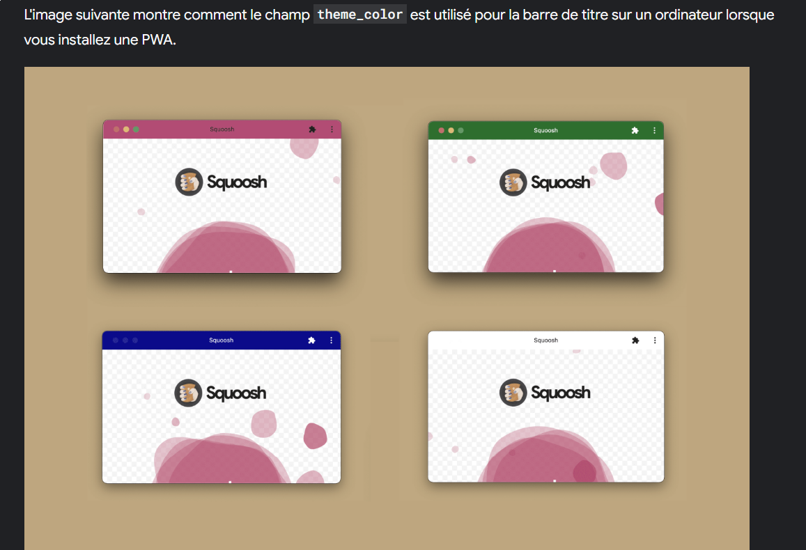
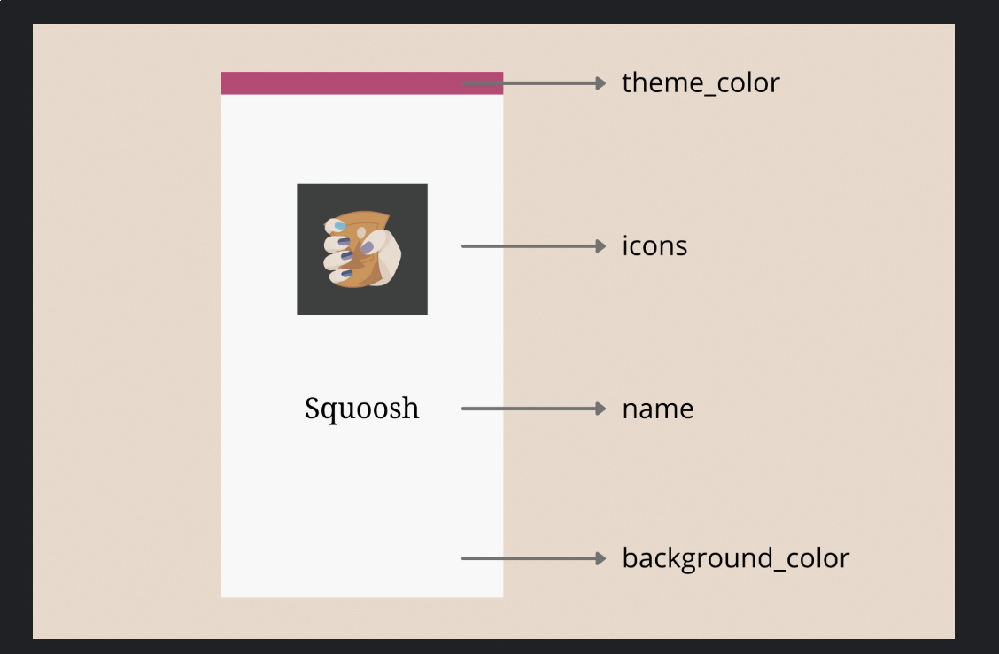

<!-- creation d'un dossier assets a la racine du projet -->
mkdir assets 

<!-- Choisir un icone 1024*1024 -->
Nommer ce fichier : logo.png et le déposer dans assets/
Exemple de site : https://www.svgrepo.com/

<!-- Parametrage des icones -->

<!-- Lancer la commande dans le terminal de votre IDE en BASH  pour generer des icones-->

npx pwa-asset-generator ./assets/logo.png ./assets/ --padding "10%" --background "#ffffff" --manifest ./manifest.json --index ./index.html

Cette commande va generer des icones dans le dossier assets/
Mettre à jour le fichier manifest.json (section icons) + fichier index.html (liens favicon, apple-touch-icon ect)

<!-- Commande a connaitre si on veut nettoyer le dossier assets/-->

Supprime tout le contenu de assets/ sans supprimer le dossier lui-même (Mac/linux/Git Bash) : rm -rf ./assets/*

Sur Windows Powershell : Remove-Item .\assets\* -Recurse -Force

<!-- Convertisseur en ligne -->
https://www.svg2png.com/

https://convertio.co/fr/svg-png/

https://cloudconvert.com/svg-to-png

Tu peux spécifier la résolution 1024x1024 selon les outils

<!-- Commandes github -->
<!-- creer une branche --> $ git remote add [name_of_your_remote] [name_of_your_new_branch]